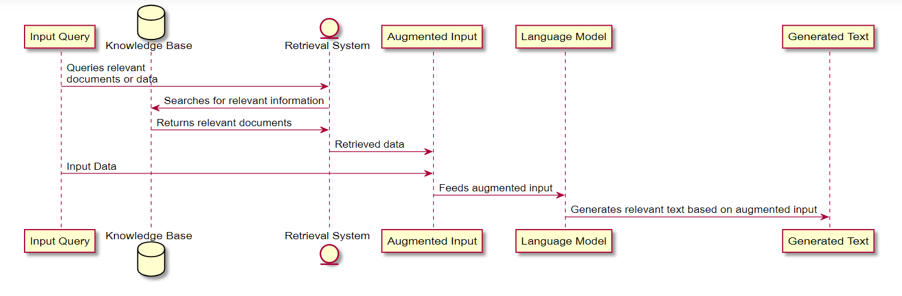

## Tailoring Language Models for Specific Tasks

LLMs are renowned for their ability to understand and generate text that closely mirrors human conversation, making them great for activities such as content creation, language translation, and sentiment analysis.

By drawing from extensive training datasets, LLMs can produce text that is coherent, contextually appropriate, and highly relevant, significantly easing the burden on developers and content creators. These models can be fine-tuned and customized for particular industries or topics, allowing them to deliver more targeted and specific outcomes.

In addition to their adaptability, LLMs can be enhanced with integrated knowledge bases, boosting their ability to deliver informed and accurate responses in specialized fields.

By leveraging the capabilities of these advanced language models, you can boost efficiency, improve accuracy, and enhance the quality of outputs across various applications.

## Diving into Customization: Fine-Tuning vs. Knowledge Base Integration

### Fine-Tuning

This method allows you to mold the LLM’s responses to fit a certain style or behaviour, making it possible for the model to emulate specific communication patterns. This can be particularly useful for personalizing interactions or creating a unique brand voice. For example, you can fine tune the LLM to respond to your chats in your own style.

### Knowledge Base Integration

This approach involves equipping the LLM with a wealth of domain-specific information, enabling it to provide answers that are not only relevant but also rich in content. This is especially beneficial for fields that require a high degree of expertise. However, the amout of knowledge that can eb augmented to a prompt depends on the max tokens the LLM can accept.

## Implementing Custom Solutions

Now that you are familiar with the most popular strategies for adapting LLMs to fit specific needs, check out the following posts for practical, step-by-step tutorials:

### [Getting Started with Fine-Tuning](https://micromastery.github.io/posts/fine-tuning-llms-for-behavioural-changes/)

### [Integrating Knowledge Bases with LLMs](https://micromastery.github.io/posts/knowledge-base-integration-using-rag/)