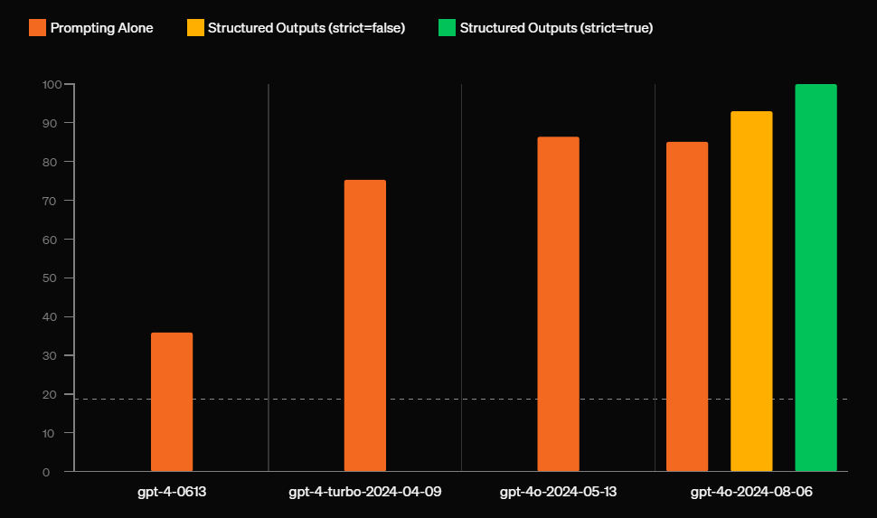

**Title**: Unlocking the Power of Structured Outputs in OpenAI and Azure OpenAI

### **Introduction**

In the rapidly evolving landscape of artificial intelligence, staying ahead of the curve means embracing innovations that make technology more intuitive, reliable, and accessible. About a month ago, OpenAI introduced a groundbreaking feature to their API: structured outputs. This advancement has quickly gained traction among developers and data scientists for its ability to produce consistent, machine-readable responses, streamlining the integration of AI into various applications.

Now, we're thrilled to see that structured outputs are available in the Azure OpenAI Service as well. This integration brings the power of structured data to the Azure ecosystem, opening doors for more robust and efficient AI solutions within Azure's secure and scalable environment.

**What We'll Cover**

In this blog post, we'll explore:

- **What Structured Outputs Are**: Understanding the concept and significance of moving beyond unstructured text to predictable, formatted data.
- **How It Works**: A look under the hood at how this feature operates within the OpenAI and Azure OpenAI APIs.
- **Why It's a Big Deal**: Discussing the transformative impact of structured outputs on AI development and deployment.
- **Comparing Pre- and Post-Structured Outputs**: Highlighting the challenges of the past and the improvements brought by this feature.
- **Practical Examples and Code**: Providing hands-on examples to demonstrate how you can leverage structured outputs in your projects.

Whether you're aiming to enhance a customer support chatbot, streamline data processing in an e-commerce platform, or simply curious about the latest in AI technology, this post will offer valuable insights into how structured outputs can elevate your work.

Let's dive in and unlock the potential of structured outputs together!


### **What Are Structured Outputs?**

At its core, a structured output allows AI models to return data in a well-defined format, such as JSON, XML, or any other structured schema. Instead of receiving raw, free-form text, users can now request specific types of information from the model in a predictable format. For example, if you need a product recommendation, you can ask the model to respond in a JSON format containing structured fields like product name, price, and description.

#### Why Is This Important?

Before structured outputs, integrating AI-generated text into applications was cumbersome. Developers often had to write extra code to parse, clean, and validate the AI’s responses. A simple request like extracting a product’s name and price from a text response required complex parsing logic, which was error-prone and inconsistent. In some cases, models would deviate from the expected format, making it even harder to handle responses in real-time systems.

Structured outputs eliminate this guesswork. By specifying the exact format for a response—like a key-value pair or an array of objects—you ensure the data is always delivered in a way that your application can process without additional validation. This feature is crucial for applications that need consistent and reliable data, such as customer support systems, product catalogs, or financial reporting tools.

### Use Cases of Structured Outputs

- **Chatbots**: Ensuring chatbot responses adhere to a predefined structure for improved conversation flow and decision-making.
- **Data Summarization**: Summarizing complex documents in a machine-readable format for automated systems to use directly.
- **Web Scraping**: A form of data summarization. When scraping websites, the data you get is often unstructured, requiring significant post-processing to format it for your system. With structured outputs, AI can process raw scraped data and directly return it in a well-defined structure, like JSON, saving you the effort of organizing it manually.

Structured outputs streamline the process of turning unstructured information from sources like web scraping into usable data without additional coding or post-processing.

### **How It Works**

Achieving 100% reliable structured outputs in OpenAI is a remarkable feat, considering that AI models are inherently non-deterministic. The team employed a two-part strategy: first, they trained the GPT-4 model to understand complex schemas, which significantly improved the model’s output reliability. However, even with a 93% success rate, the randomness of model behavior remained an issue. 

The real breakthrough came with the introduction of **constrained decoding**. In unconstrained sampling, the model is free to choose any token (like a curly brace or a comma) at any time, which can lead to invalid outputs—especially when adhering to strict formats like JSON. With constrained decoding, OpenAI tackled this by dynamically restricting the model to generate only tokens that are valid according to the defined schema at each step.



*Image source: [openai](https://openai.com/index/introducing-structured-outputs-in-the-api/)*

#### How Does Constrained Decoding Work?

To ensure every token matches the required schema, OpenAI converts the JSON Schema into a  [**context-free grammar**](https://en.wikipedia.org/wiki/Context-free_grammar), which essentially defines a set of rules that govern valid outputs. The model uses this grammar to guide its generation process, ensuring that only tokens valid at any given step are considered. For example, after generating an opening curly brace `{`, it restricts the model from producing another `{` until it's logically valid based on the schema. This ensures that the generated output adheres exactly to the structure specified.


This process incurs a slight latency when handling new schemas, as the grammar needs to be precomputed. However, once processed, the system uses cached data to minimize any performance impact during actual generation. The ability to reliably generate structured outputs without manual validation is a significant improvement in model deployment, particularly in applications that require strict formatting like APIs, data pipelines, or enterprise systems.

This dynamic token validation is why OpenAI can guarantee 100% adherence to specified formats. It’s not just an impressive technical achievement, but a game changer for developers building AI-driven applications that need to rely on structured, predictable outputs. To dive deeper into how context-free grammars work, you can explore more about

This blend of AI learning and deterministic engineering is a big leap forward for reliable AI output in complex production environments.

### **Section 3: Why This Is a Big Deal**

#### **Before Structured Outputs**

Before structured outputs, developers faced significant challenges integrating AI-generated responses into real-world applications. Models like GPT-3 produced free-form text, which, while useful for conversational AI, presented a problem when precise, machine-readable formats were required. For example, parsing AI responses for structured data, like JSON, often involved complex post-processing steps, including writing custom scripts and regex patterns. These steps were not only error-prone but added extra time and development effort to ensure the output fit into structured systems like databases, APIs, or spreadsheets.

Unpredictable formatting meant that developers had to account for a range of edge cases, such as missing fields, inconsistent syntax, or extra data that didn’t belong. This made it difficult to scale AI applications in environments that demanded reliable and structured information, like finance, e-commerce, or data science platforms. For enterprise applications, this lack of consistency was a dealbreaker in many situations, requiring manual validation or extensive logic to clean and transform data into the desired format.


*Before structured output*

*After structured output*

#### **Real-World Impact**

Structured outputs radically change this picture by ensuring AI responses follow a predictable format, which directly integrates with traditional software systems. This improvement simplifies development, eliminating the need for complex post-processing and validation steps. For instance, in a customer support application, structured outputs ensure the AI returns exactly the right fields—such as issue type, user data, and timestamp—so that the system can automatically file a support ticket without needing additional parsing.


This feature doesn’t just benefit developers—it also reduces operational risks and increases efficiency across the board. Companies can now confidently deploy AI models in environments where guaranteed accuracy and format compliance are critical.

---

### **Section 4: Structured Outputs in Azure OpenAI**

#### **Recent Integration**

With the recent addition of structured outputs in the Azure OpenAI Service, Microsoft has now extended OpenAI’s powerful new feature to its platform. This integration enables Azure developers to leverage OpenAI’s models that support structured outputs making it easier to build reliable applications within the Azure cloud.

#### **Security and Compliance**

Azure’s strength lies in its enterprise-grade security, and with structured outputs, this advantage becomes even more significant for industries that must comply with strict regulations. Data consistency plays a critical role in regulated industries, where structured outputs ensure that AI-generated data is always in the expected format, reducing the risk of data mishandling, errors, or compliance breaches.

For industries bound by standards such as **HIPAA** or **GDPR**, this feature provides extra reassurance that outputs are validated and constrained, minimizing any chance of inadvertently non-compliant or malformed data entering systems. The combination of structured outputs and Azure’s secure infrastructure makes this feature especially valuable for applications dealing with sensitive or mission-critical data.


### Practical Examples and Code**

Let's look at two scenarios to demonstrate how structured outputs make a significant difference in handling complex AI responses. We’ll use an example from the **data summarization domain**: summarizing a research paper and returning structured data like the paper’s title, abstract, key findings, and citations in JSON format.

#### **Sample 1: Without Structured Outputs**

Before structured outputs, you’d have to rely on prompt engineering to encourage the model to return the data in a specific format. However, due to the stochastic nature of the model, there’s no guarantee it will always adhere to the format—especially with complex, nested structures.

**Example Prompt Without Structured Outputs:**

```python
prompt = """
Summarize the following research paper and return the result in JSON format. Include the following fields: 
- Title
- Abstract
- Key Findings
- Citations (with author, title, and year).

Paper: [INSERT RESEARCH PAPER TEXT HERE]

Output Example:
{
  "Title": "...",
  "Abstract": "...",
  "Key Findings": ["...", "..."],
  "Citations": [{"author": "...", "title": "...", "year": "..."}]
}
"""
response = openai.Completion.create(engine="gpt-4", prompt=prompt)
print(response.choices[0].text)
```

In this scenario, the model might output something that resembles JSON, but it could have errors. For example:

- Missing or malformed fields.
- Incorrectly nested elements.
- Responses that break the schema (e.g., citations as plain text rather than structured).

You’d need to write additional code to validate and correct the structure, using techniques like regex, which are tedious and prone to error:

```python
# Example: Post-processing logic to validate JSON structure
try:
    result = json.loads(response.choices[0].text)
    # Validate the result
except ValueError:
    # Handle malformed JSON
    pass
```

#### **Sample 2: With Structured Outputs**

With structured outputs, the process is much more streamlined. You define the schema upfront, and the model is constrained to only output valid JSON that matches the schema exactly, eliminating the need for post-processing or validation.

**Example Prompt With Structured Outputs:**

```python
schema = {
    "type": "object",
    "properties": {
        "Title": {"type": "string"},
        "Abstract": {"type": "string"},
        "Key Findings": {
            "type": "array",
            "items": {"type": "string"}
        },
        "Citations": {
            "type": "array",
            "items": {
                "type": "object",
                "properties": {
                    "author": {"type": "string"},
                    "title": {"type": "string"},
                    "year": {"type": "string"}
                },
                "required": ["author", "title", "year"]
            }
        }
    },
    "required": ["Title", "Abstract", "Key Findings", "Citations"]
}

response = openai.Completion.create(
    engine="gpt-4",
    prompt="Summarize the following research paper...",
    max_tokens=1000,
    temperature=0,
    output_format="json",
    json_schema=schema
)
print(response.choices[0].json)
```

In this scenario, the AI is constrained by the schema during the generation process. No matter how complex the structure, the model will only output data that fits within the JSON schema. There’s no need to manually parse or validate the response—**the output is guaranteed to be correct**. Even nested structures like citations are reliably formatted.

Structured outputs have simplified AI implementations dramatically, especially for complex tasks like data summarization. By eliminating unpredictable outputs, this feature ensures smoother integration and greater efficiency in real-world applications.

### **Conclusion**

Structured outputs represent a leap forward for AI developers, offering significant benefits in time-saving, error reduction, and seamless integration. By ensuring that AI responses are always returned in a predictable, machine-readable format like JSON, developers can avoid the hassles of manual post-processing and focus on building reliable, efficient applications. This feature enhances machine-to-machine communication, making it easier to integrate AI models into real-world workflows.

Whether you’re using OpenAI or Azure OpenAI, try structured outputs in your next project. Get started by exploring [OpenAI's documentation](https://platform.openai.com/docs/guides/structured-outputs/introduction) or [Azure’s guide](https://learn.microsoft.com/en-us/azure/ai-services/openai/how-to/structured-outputs?tabs=python-secure) today!
