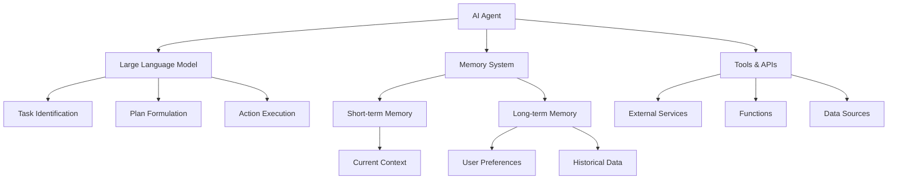
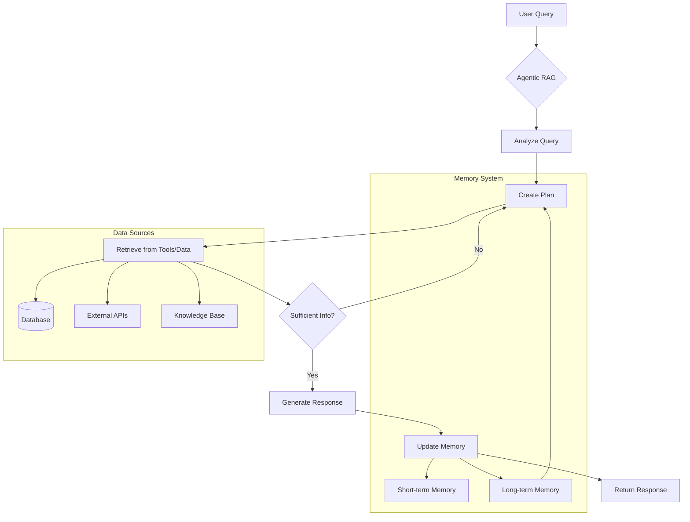
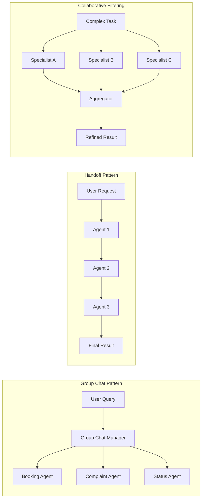
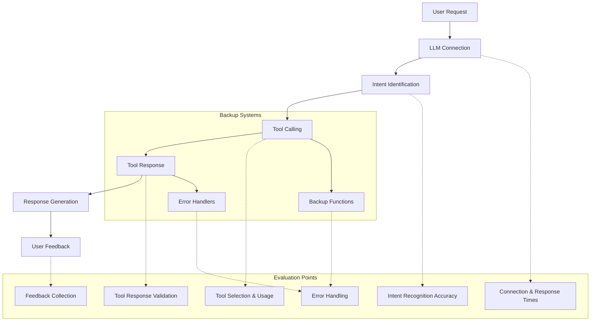
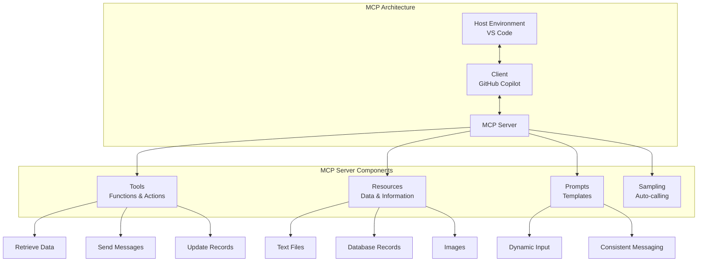

# My Notes on Agentic AI - Fundamentals

## Introduction

AI agents are rapidly transforming how we interact with technology, moving beyond simple task execution to complex problem-solving. In this comprehensive guide, we'll explore what AI agents are, the core components that power them, essential design principles, various architectural patterns, and practical considerations for building and deploying them effectively.

### What We'll Cover

In this blog post, we'll dive deep into:

- **What AI Agents Are**: Understanding the fundamental concepts and components
- **Design Principles**: The key principles for building effective AI agents
- **Design Patterns**: Essential patterns like tool use, agentic RAG, and multi-agent collaboration
- **Production Deployment**: Practical considerations for real-world deployment
- **Frameworks and Protocols**: Overview of agentic frameworks and the Model Context Protocol

Whether you're a developer looking to build intelligent systems, a product manager exploring AI capabilities, or simply curious about the future of AI agents, this post will provide valuable insights into this exciting field.

## What Are AI Agents?

At their core, **AI agents** are sophisticated systems designed to understand user requests, create plans to fulfill those tasks, and execute actions to complete them. They represent a significant evolution from simple AI models to intelligent entities capable of autonomous decision-making and task execution.

### Core Components of AI Agents

The fundamental parts of an AI agent include:

- **Large Language Model (LLM)**: This is the **reasoning engine** behind AI agents. It enables them to identify user-requested tasks, formulate a plan to complete them, and perform the necessary actions.
- **Memory**: AI agents utilize memory to improve over time. This can be **short-term memory** (the immediate conversation context) or **long-term memory** (a collection of data for ongoing improvement). For example, an agent might remember your toothpaste flavor preference from long-term memory or the current status of your teeth brushing from short-term memory.
- **Tools**: These are external services, APIs, functions, or data sources that allow agents to perform actions or gather information. An agent uses its LLM to recognize a task, identify needed tools, and use memory to collect necessary data.

## Principles for Building Good AI Agents

Three key principles contribute to effective AI agent design:

- **Space**: This refers to the agent's environment. Good agents should connect events, people, and knowledge, be easily discoverable, and seamlessly transition between foreground and background use based on user needs. Clear instructions on usage and limitations should be provided, perhaps in the UI/UX.
- **Time**: This principle emphasizes how an agent operates over time with a user, allowing for **improvement through reflection** and connection to past events. Displaying past prompts and interactions in the UI helps users understand the agent's long-term context.
- **Core**: This involves embracing **uncertainty** inherent in LLM-driven planning. Building trust and transparency is crucial, empowering users with visible controls and feedback mechanisms, much like video playback controls (pause, play, captions).

## Key Design Patterns for AI Agents

Several design patterns enable AI agents to perform complex tasks and work collaboratively:

### Tool Use Design Pattern

- While LLMs are powerful on their own, **external tools** are often needed to complete user tasks, such as calculators, APIs for flight status, or currency exchange functions.
- Agents can **combine multiple tools** to automate complex workflows, like analyzing an email, retrieving knowledge base information, and forwarding it to customer service.
- Tools can be configured to be called **automatically** by the agent or **required** for specific scenarios.
- LLMs' ability to interpret natural language means developers don't need to define every specific condition (e.g., "is a city in Europe?") if the LLM's base training data covers it.

### Agentic Retrieval Augmented Generation (RAG)

- **Basic RAG** allows LLMs to retrieve relevant information from a database and add it to the conversation context, providing more relevant responses beyond just training data.
- **Agentic RAG** enhances this by enabling the agent to analyze the query, create a plan of smaller tasks using data sources and tools, and **verify if retrieved information is sufficient**. If not, it can repeat the tool-calling process.
- A key benefit is the agent's ability to **maintain long-term memory** of this process, recalling previous attempts to improve future interactions.

### Planning Design Pattern

- This pattern explicitly has an AI agent list the **subtasks** that constitute a more complex task. For example, a travel plan can be broken into booking flights, hotels, and activities.
- It's especially impactful with **multiple agents**, where subtasks can be completed by separate agents or processes.
- The agent's output can be **structured** (e.g., JSON) and **validated** to ensure all necessary information is present for subsequent steps or other agents.

### Multi-Agent Design Pattern

This involves **multiple AI agents working together** to achieve a common goal. Different patterns apply based on their objective:

- **Group Chat**: Messages are broadcast to all agents, and a "group chat manager" (often another agent) selects the appropriate agent to handle the task (e.g., separate agents for booking, complaints, or flight status in customer service).
- **Handoff Pattern**: Agents complete sequential steps in a defined workflow, passing the task to the next agent upon completion.
- **Collaborative Filtering**: Each agent acts as a specialist, responding to a task in its unique way, ideal for analysis requiring diverse inputs or perspectives.

This allows agents to **refine results** by providing feedback to each other, leading to better suggestions than a single agent alone.

### Metacognition Design Pattern

- **Metacognition** in AI agents means "thinking about thinking". Agents use data and analysis to identify errors, make improvements in their planning and responses, and **adapt over time**.
- This enables agents to be more transparent in their reasoning, adapt to changing environments, and improve data interpretation.
- An agent can reflect on decisions (e.g., how it defines the "best" flight) and incorporate user preferences for future decisions, requiring the system to gather, store, and retrieve feedback.

## Building Trustworthy and Effective AI Agents

### Key Architectural Considerations

- **System Message Framework**: This framework is crucial for setting **clear and specific instructions** for AI agents. It involves using a basic system message as a template to generate more detailed prompts, covering responsibilities, tone, style, and interaction instructions. This promotes **iterative prompt building** and scalability across multiple agents.
- **Human-in-the-Loop Architecture**: For scenarios requiring human approval or intervention, this architecture integrates a human user into the multi-agent cooperation workflow. Agents can be instructed to perform specific actions when a human input like "approve" is detected.
- **Security and Privacy**: Considerations include ensuring agents have only the **required access** to tools and data. It's recommended to **exercise caution with databases in production** due to potential vulnerabilities, even with read-only access. Overall, LLM security requires careful measures.

## Deploying AI Agents to Production

Getting AI agents ready for real-world use requires rigorous **evaluation at every step** of the system, not just the final output. Key evaluation points include:

- Initial request to the LLM (connection, response times, model selection).
- Agent's ability to identify user intent and complete the requested task.
- Agent's ability to identify and use the correct tools.
- Tool response to the agent's request (errors, malformed responses, uptime issues).
- Collecting user feedback (e.g., thumbs up/down in UI, manual evaluation, or using LLMs to judge responses).
- Preparing for scenarios where external services might be down or return errors by implementing **backup functions**.

## Agentic Frameworks and Model Context Protocol

### Popular Agentic Frameworks

Several **agentic frameworks** assist in building AI agents by offering control over task management, contextual understanding, and agent collaboration. Examples include:

- **Azure AI Agent Service**: Designed for single agents, integrating well with existing Azure services.
- **Semantic Kernel**: An enterprise-focused framework supporting C#, Java, and Python, with various model connectors.
- **Autogen**: From Microsoft Research, focusing on enabling experimentation with the latest agentic research ideas.

### Model Context Protocol (MCP)

The **Model Context Protocol (MCP)** is an **open protocol** that standardizes how applications provide context to LLMs, often compared to USB-C for AI. It helps connect various resources beyond just code.

MCP interactions involve three key parts:

- **Hosts**: The environments or tools where MCP operations occur (e.g., VS Code).
- **Clients**: The tools used to interact with MCP servers (e.g., GitHub Copilot).
- **Servers**: Provide the core functionality, tools, and resources.

MCP servers expose:

- **Tools**: Functions invoked by the model to perform actions (e.g., retrieving data, sending messages, updating records).
- **Resources**: Ways to expose information or data to the application (e.g., text, files, database records, images), which can reduce token usage and provide assets to the user.
- **Prompts**: User-controlled, predefined templates for interactions with the AI tool, allowing for dynamic input and consistent messaging.
- **Sampling**: A way for the client (e.g., VS Code) to default to auto-calling an LLM to run a command or query a resource, keeping context in mind.

## Conclusion

Building AI agents is an evolving field that demands continuous experimentation to find the right balance between the model, prompt, and context to achieve optimal results. As we move forward, the combination of well-designed agents, robust frameworks, and standardized protocols like MCP will enable more sophisticated and reliable AI systems.

The future of AI agents lies not just in their individual capabilities, but in their ability to work together, learn from experience, and seamlessly integrate into our digital workflows. Whether you're building a simple task automation agent or a complex multi-agent system, understanding these core concepts and patterns will be essential for success.

---

*This blog post covers the fundamental concepts of AI agents as of July 2025. The field continues to evolve rapidly with new patterns and frameworks emerging regularly.