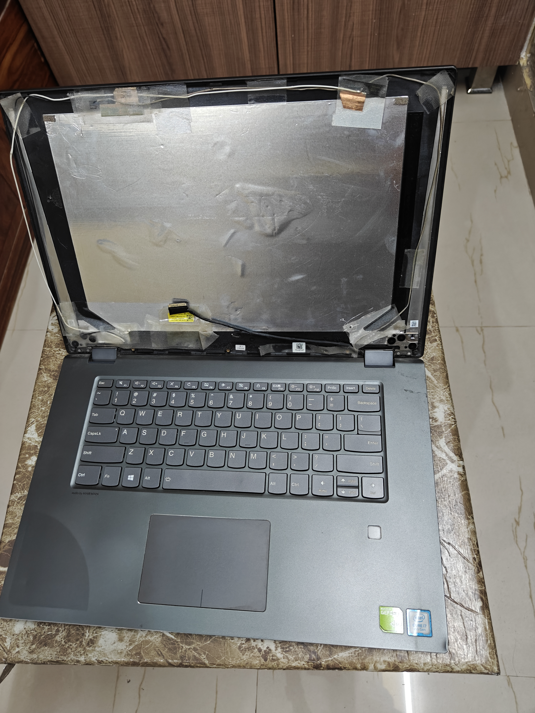
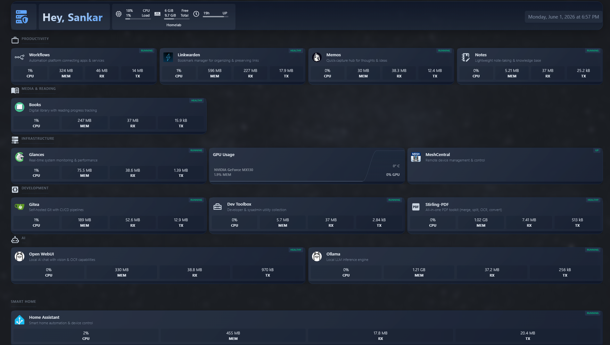

> **Part 1** of the [Homelab Series](/categories/homelab-series/) — building a home server from a broken laptop.

## A Laptop With No Screen

A few months ago, I was cleaning my room and found my old college laptop — a Lenovo Flex 5 from 2019. i7-8550U, 16GB RAM, MX130 GPU, 512GB SSD. Not bad specs even today.

The thing is, it has no screen. The display cracked after a fall, and when I took it to a repair shop, the guy managed to break it completely and said "replacement not found." So it sat in a drawer for years.

  
   
  <em>The patient — a 2019 Lenovo Flex 5 with a shattered screen but perfectly good internals.</em>

I have a much better laptop now, so this one had no purpose. But 16GB RAM and an i7 sitting idle felt like a waste. The thought clicked — **what if I turn this into a home server?**

## What's Running On It Today

Here's what this screenless laptop now serves 24/7:

| Category | Services |
|----------|----------|
| **Productivity** | n8n (workflows), Linkwarden (bookmarks), Memos (notes), NoteForge (dev notes) |
| **AI** | Ollama + Open WebUI running gemma3:4b locally |
| **Media** | Kavita (ebooks & comics library) |
| **Smart Home** | Home Assistant |
| **Dev Tools** | Gitea (Git + CI/CD), DevToolbox (25+ utilities), Stirling-PDF |
| **Infrastructure** | Nginx reverse proxy, Cloudflare tunnel, Glances (monitoring), MeshCentral (remote access) |

All accessible from anywhere via custom subdomains, secured through Cloudflare.

  
   
  <em>The Homepage dashboard — a single pane of glass for all services.</em>

## The Setup in 30 Seconds

The physical setup is dead simple:

- Laptop sits behind the router on a shelf
- Ethernet cable + power supply — that's it
- Windows 11 with Docker Desktop (WSL2 backend)
- 10GB allocated to WSL, 6GB for Windows

No rack, no fancy hardware, no UPS. Just an old laptop doing honest work. For now.

## The Journey (and This Series)

It didn't start this clean. The path looked like this:

1. **CMD window** — I honestly thought I'd try this for a couple weeks and abandon it. No point setting up WSL or Docker for a weekend experiment. So each service ran in its own CMD window. It worked until the first Windows Update restarted the laptop at 3 AM.
2. **Cloudflare tunnel** — ISP router had no port forwarding option. Cloudflare Tunnels solved public access without exposing ports.
3. **MeshCentral** — Got tired of plugging in a monitor every time I needed to configure something. Self-hosted remote access fixed this.
4. **Docker Desktop + WSL** — The jump that made everything maintainable. Containers restart themselves, survive updates, and configs are just YAML files.
5. **Gitea + CI/CD** — Push to Git, runner deploys automatically. No more SSH-ing in to update things.

Each of these steps is its own post in this series. I'll walk through the actual setup, the problems I hit, and how I solved them.

## What You Need to Follow Along

If you want to replicate this, here's the minimum:

- **Any old computer** — Laptop, desktop, mini PC. I have 16GB RAM so I can run a dozen+ containers, but only a 2GB GPU so I'm limited to smaller AI models. Your hardware decides your ceiling — not whether you can start.
- **Ethernet connection** — I started with WiFi and it worked fine. Switched to ethernet later for reliability, but it's not a hard requirement to get started.
- **A domain** — I use Cloudflare for DNS. A `.com` domain costs ~$10/year.
- **Docker** — Whether you're on Linux, Windows+WSL, or Mac, Docker is the foundation.

You don't need Linux. You don't need port forwarding. You don't need a static IP. I have none of these and everything works fine.

## Why Self-Host?

I'm a software engineer — I work with cloud services daily. So why run things locally?

- **Privacy** — Notes, bookmarks, PDFs, AI conversations — none of it leaves my house.
- **It's fun** — There's something satisfying about typing your own domain and hitting a service running 3 feet away from you.
- **Learning** — Networking, Docker, CI/CD, reverse proxies, Linux — all in one project.

The electricity cost is negligible (laptop idles at ~15W), which is cheaper than any single SaaS subscription.

## What's Next

In the next post, I'll cover the first real problem I hit: **my ISP router doesn't support port forwarding**. I'll show how Cloudflare Tunnels give you public access to your home server without exposing a single port, and why this is actually *more* secure than traditional port forwarding.

---

*All the code and configurations for my home server are open source: [github.com/mavsankar/homeserver](https://github.com/mavsankar/homeserver)*
