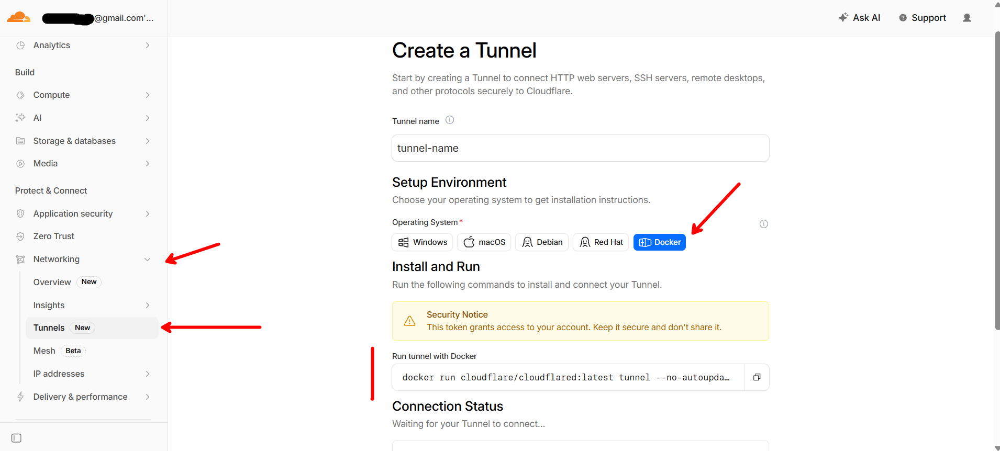
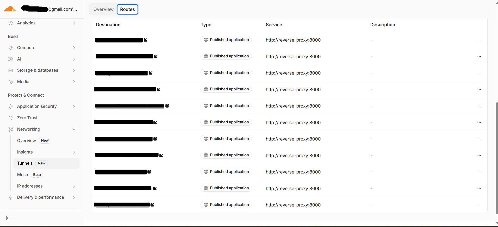
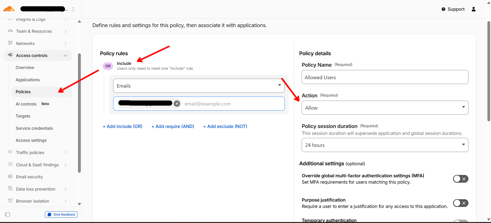
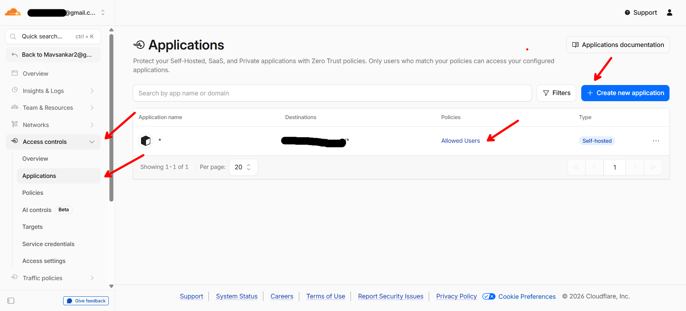

> **Part 2** of the [Homelab Series](/categories/homelab-series/) — exposing your home server to the internet without opening a single port.

## The Problem

My ISP router has a web gateway where I can configure firewall rules and other settings, but **port forwarding is restricted to business plans**. No amount of Googling or calling support changed that. Without port forwarding, nothing running on my laptop is reachable from outside my home network.

As a developer, I use Microsoft Dev Tunnels at work all the time — temporary public URLs for local services during development. I needed the same thing but permanent: custom domains, running as a daemon, and free. That led me to **Cloudflare Tunnels**.

## What is a Cloudflare Tunnel?

A Cloudflare Tunnel creates an outbound-only connection from your server to Cloudflare's edge network. Traffic flows like this:

```
User → Cloudflare Edge → Tunnel → Your Server
```

Your server **dials out** to Cloudflare — no inbound ports needed. NAT and port forwarding no longer matter, as long as the server can make outbound connections to Cloudflare (restrictive firewalls must allow outbound access to Cloudflare, including port `7844` for Tunnel operation). If your machine can make HTTPS requests, it can serve traffic.

This is actually **more secure** than traditional port forwarding because:
- No ports exposed on your router
- No need for a static IP
- Cloudflare handles DDoS protection, SSL/TLS, and caching
- Traffic is encrypted in transit (note: Cloudflare terminates TLS at its edge, so it can see your traffic in plaintext — more on this trade-off later)

## Prerequisites

- A domain managed by Cloudflare (free plan works)
- A Cloudflare account with Zero Trust enabled (also free for up to 50 users)
- `cloudflared` running on your server (Docker or native)

## Setting It Up

### 1. Create a Tunnel

Go to [Cloudflare Zero Trust Dashboard](https://one.dash.cloudflare.com/) → Networks → Tunnels → Create a tunnel.

Give it a name (e.g., `homeserver`), and Cloudflare generates a **tunnel token**. This token is what your server uses to authenticate.

<p align="center">
  
  <br>
  <em>Creating a tunnel in Cloudflare Zero Trust — the generated token is all your server needs. (In the screenshot, the token is on the right side of the docker command)</em>
</p>

### 2. Run cloudflared

The simplest way — a single Docker container:

```yaml
services:
  cloudflared:
    image: cloudflare/cloudflared:latest
    container_name: cloudflared
    restart: always
    command: tunnel run
    environment:
      - TUNNEL_TOKEN=${CLOUDFLARE_TUNNEL_TOKEN}
    networks:
      - homeserver
```

Set your token in a `.env` file:

```
CLOUDFLARE_TUNNEL_TOKEN=eyJhIjoiYWJjZGVm...
```

That's it. `docker compose up -d` and the tunnel is live.

### 3. Add Public Hostnames

Back in the Cloudflare dashboard, add routes for each service. Each route maps a subdomain to an internal service:

| Public Hostname | Service | URL |
|----------------|---------|-----|
| `landing.yourdomain.com` | HTTP | `http://homepage:3000` |
| `books.yourdomain.com` | HTTP | `http://kavita:5000` |
| `ai.yourdomain.com` | HTTP | `http://open-webui:8080` |

Or you can point a wildcard subdomain to a reverse proxy (like Nginx) that handles routing based on the hostname. This is what I do — all traffic goes to `cloudflared`, which forwards to Nginx, and Nginx routes to the right container. More on that in a later post.

<p align="center">
  
  <br>
  <em>Each subdomain routes to the reverse proxy — Nginx handles the rest.</em>
</p>

## Architecture Overview

Here's how the full flow works:

```
Internet
    │
    ▼
Cloudflare Edge (SSL termination, DDoS protection)
    │
    ▼ (encrypted tunnel, outbound-only)
cloudflared container
    │
    ▼
reverse-proxy (Nginx, port 8000)
    │
    ├── landing.* → homepage:3000
    ├── books.* → kavita:5000
    ├── ai.* → open-webui:8080
    ├── pdf.* → stirling-pdf:8080
    └── ... (12+ services)
```

All containers sit on the same Docker network (`homeserver`), so Nginx can reach them by container name.

## Access Policies (Optional but Recommended)

For services that don't have their own authentication (like my homepage dashboard and dev tools), I use **Cloudflare Access policies**. These add a login gate before the tunnel even reaches your server:

- Go to Zero Trust → Access → Applications
- Add a Self-hosted application
- Set the domain (e.g., `landing.yourdomain.com`)
- Add a policy: allow emails matching your own email, one-time PIN verification

Now even if someone guesses your subdomain, they hit a Cloudflare login screen before reaching anything.

<p align="center">
  
  <br>
  <em>Cloudflare Access adds a login gate — one-time PIN to your email before anything loads.</em>
</p>

<p align="center">
  
  <br>
  <em>Assigning a Cloudflare Access policy to an application — ensures only authorized users can access the service.</em>
</p>

## What This Costs

- Cloudflare account: **Free**
- Tunnel: **Free** (no metered bandwidth, though Cloudflare's free-plan terms discourage serving large volumes of video/file downloads)
- Domain: ~$10/year
- Zero Trust (up to 50 users): **Free**

Total: the cost of a domain name.

## Why Not Tailscale?

This comes up a lot. [Tailscale](https://tailscale.com/) is another popular solution for accessing home services without port forwarding. Tailscale creates a private WireGuard-based mesh between your devices, so you do not need to expose the service publicly or run a public reverse proxy.

**Tailscale is great if:**
- You primarily need access from your own devices (mesh VPN between them)
- You want a private network with minimal setup
- You don't need custom domains (Tailscale Funnel gives you a `*.ts.net` URL but not your own domain, and is limited to ports `443`, `8443`, and `10000`, TLS-only, with non-configurable bandwidth limits)

**I chose Cloudflare Tunnels because:**
- I want **public URLs** with custom subdomains — sharing a link to my Kavita library or letting someone access a specific service without installing anything
- Cloudflare handles **SSL, DDoS protection, and caching** for free
- **Zero Trust access policies** let me gate specific services behind email-based login (no VPN client needed on the accessing device)
- It works with the same domain I already use for everything else

The tradeoff is clear: Tailscale is simpler and more private; Cloudflare Tunnels give you public-facing services with fine-grained access control. If you don't need public access, Tailscale is the easier answer. I needed both public and private access patterns, so Cloudflare was the better fit.

You could also use both — Tailscale for admin access (SSH, MeshCentral) and Cloudflare for user-facing services. Many homelabbers apparently do this.

## Before and After

**Before Cloudflare Tunnel:**
- Services only accessible on home WiFi

**After:**
- Every service accessible from anywhere with a clean URL
- SSL/TLS handled automatically
- No ports exposed, no static IP needed
- Takes 30 seconds to expose a new service

## What's Next

In my actual journey, the next thing I set up was MeshCentral for remote access (since I was still plugging in a monitor every time). But for this series, I'll go in **logical order** — building up the infrastructure layer by layer so you don't have to go through the refactoring and readjustments I did.

Next up: **Docker + Nginx** — how I moved from fragile CMD windows to Docker Compose, and set up a reverse proxy so every service gets its own clean subdomain.

---

*All the code and configurations for my home server are open source: [github.com/mavsankar/homeserver](https://github.com/mavsankar/homeserver)*
